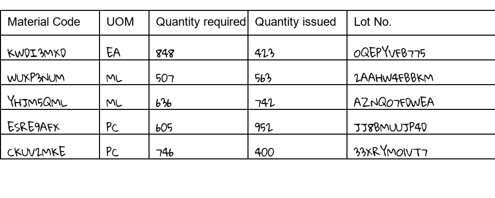
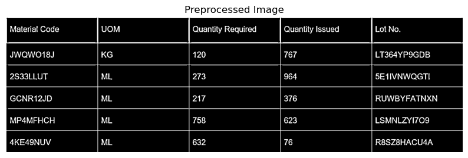
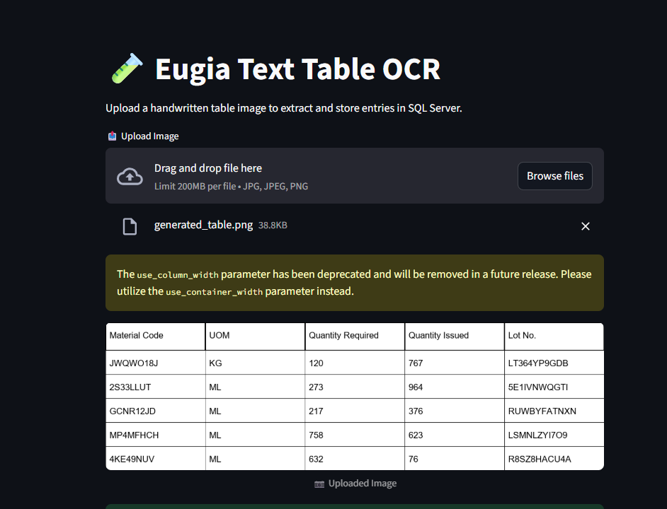
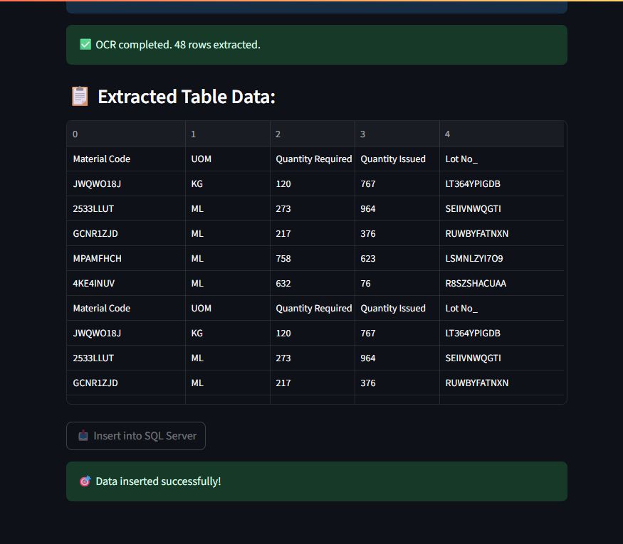
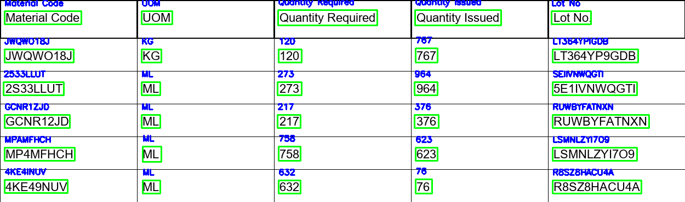

# Handwriting OCR – Aurobindo Pharma Internship Project

This repository contains the full implementation of an OCR pipeline designed to extract handwritten and typed pharmaceutical tables from scanned images and automatically insert the structured data into a SQL Server database.

This project was completed as part of our internship, where the focus was on solving a real-world challenge of digitizing handwritten material logs in a secure and scalable way.

---

## Project Objective

To develop a machine learning-based OCR system that:
- Detects and extracts handwritten tables (Material Code, UOM, Quantity Required, Quantity Issued, Lot No.)
- Preprocesses the image for clarity and alignment
- Recognizes handwritten/typed text using OCR models
- Parses and validates extracted text into structured format
- Inserts final records into **Microsoft SQL Server** under secure access
- Deploys a **Streamlit** frontend for uploading documents and triggering the end-to-end pipeline

---

## ⚙️ Tech Stack

| Layer | Tools / Technologies |
|-------|----------------------|
| OCR Models | EasyOCR, PaddleOCR, Tesseract, CRNN + CTC |
| Image Processing | OpenCV, NumPy, Matplotlib |
| Backend | Python |
| Database | Microsoft SQL Server |
| Frontend | Streamlit |
| IDEs | Jupyter Notebook, Visual Studio Code |
| Environment | Local Machine (GPU unavailable) |

---

## Dataset Generation

One of the biggest challenges encountered was the unavailability of a standardized, labeled dataset. Due to the sensitive and confidential nature of the pharmaceutical data involved, we were not provided with any real-world handwritten samples to train or evaluate our OCR models effectively.

To overcome this, we designed and generated our own synthetic dataset based on realistic formats observed in our work environment. We created structured table images from scratch using Python's `PIL` and `pandas` libraries, ensuring that they mimic actual forms typically found in pharmacy logs.

These synthetic table images consist of 5 key columns:
- **Material Code**
- **UOM (Unit of Measure)**
- **Quantity Required**
- **Quantity Issued**
- **Lot Number**

Each image contains 5 rows of randomized but realistic entries. To simulate handwritten-like variations, we experimented with different font styles and placements. Two batches of such images were created and paired with corresponding `.csv` label files containing the exact entries for supervised learning or evaluation.

---

> This approach allowed us to continue development and testing of our OCR pipeline without compromising on data privacy, while giving us control over table structure and content complexity.

---

## 🧹 Preprocessing Stage

Before feeding any table image into the OCR engine, it was essential to clean and standardize the visual content to improve recognition accuracy. The preprocessing phase played a critical role in transforming raw input images into clean, structured data ready for OCR. This stage helped eliminate noise, normalize lighting conditions, and enhance the clarity of text — both handwritten and typed.

We used four key preprocessing techniques:

### 1. Thresholding
Thresholding was applied to convert grayscale images into binary format. By setting a fixed or adaptive threshold, we made the background white and the text black. This made the actual content stand out clearly and removed unnecessary background details.

### 2. Binarization
Binarization improved contrast and removed color information from the images. Techniques like adaptive thresholding were used to manage varying illumination levels across a single image. This greatly increased text edge sharpness, helping downstream OCR models extract clean characters.

### 3. Noise Reduction
To deal with scanning artifacts, stray marks, and distortions, we used noise reduction techniques such as median blurring and morphological operations. This was especially important for handwritten documents, where irregular strokes or overlaps could confuse the model.

### 4. Grayscaling
All images were first converted to grayscale to simplify processing. This step reduced the data from three color channels (RGB) to one, while retaining essential visual details. It served as the foundation for the other preprocessing operations.

The output of this preprocessing pipeline was a clean, binary version of the original image—optimized for accurate OCR. Sample before-and-after images are included in this repository to illustrate the effectiveness of preprocessing.

---

## Models Tested

We evaluated multiple OCR models to find the best fit for handwritten structured tables:

### 1. **Tesseract OCR**
- Tesseract OCR was the first model we integrated into our pipeline as a baseline reference for extracting text from handwritten and printed table images. We utilized the Python pytesseract wrapper to automate the process and ran it on a collection of scanned table images. The language used for OCR was set to English (eng), and the input data consisted of PNG images of pharmaceutical material logs.
- In terms of functioning, Tesseract works by performing a series of steps that include image binarization, text line detection, word segmentation, and character recognition using traditional OCR algorithms and LSTM-based models. However, its architecture is not well-equipped to handle the inconsistencies and variations that comes with human handwriting.
- Tesseract delivered highly unreliable results for handwritten data.

### 2. **EasyOCR**
-  Best performance on typed text (95% accuracy)
-  Moderate performance on handwritten data (60%)
-  Seamless integration with Streamlit
-  Used in final typed-text pipeline

### 3. **PaddleOCR**
-  Excellent for table recognition due to structured layout support
-  Required extensive preprocessing and bounding box accuracy. One of the key challenges we faced was identifying accurate bounding boxes around handwritten entries and determining appropriate x-ranges for each column. This process required intensive preprocessing and fine-tuning, as slight deviations led to misaligned outputs. Despite the difficulty, we successfully managed to define consistent x-ranges and extract rows correctly. While PaddleOCR showed promise, it struggled with overlapping characters and low-contrast handwriting, which occasionally affected recognition accuracy.
-  Errors due to overlapping handwriting and low contrast

### 4. **Custom CRNN + CTC**
-  Architecture understood but not implemented due to lack of dataset which was not provided by the company. 
-  Requires lot of high processor and labeled handwriting dataset for training and was difficult to run on normal laptop cpu.
-  Future potential if proper data is collected

---

## 📁 Project Pipeline

### 1. **Preprocessing**
- Grayscale conversion
- Thresholding
- Contour detection
- Bounding box extraction for each cell
- Individual cell cropping using OpenCV

### 2. **OCR Recognition**
- Each cell passed through EasyOCR or PaddleOCR
- Detected text stored in temporary structures

### 3. **Post-Processing & Validation**
- Parsed rows using heuristics (e.g., length checks)
- Ignored malformed or ambiguous rows

### 4. **Database Integration**
- Used `pyodbc` to connect to SQL Server
- Final validated rows inserted into table: `eugiaDB.dbo.pharmacy_material_log`

### 5. **Frontend Deployment**
- Built an interactive Streamlit UI
- Allowed pharma team to upload images and view parsed output
- Backend connected directly to SQL insert logic

---

##  Key Achievements

- Developed a full-fledged pipeline from image → SQL Server using real-world pharma tables
- Achieved high accuracy on typed tables (95%) using EasyOCR

One of the key achievements of this project is the significant reduction in manual effort required to digitize handwritten or typed log sheets. Traditionally, this process involved time-consuming and error-prone data entry. With the help of our OCR pipeline, physical records can now be directly scanned, processed, and stored into structured SQL databases automatically.

---

## Challenges Faced

- Handwritten entries often slanted or out of column which required lot of preprocesing to solve.
- Lack of a labeled handwriting dataset prevented model fine-tuning which led to facing difficulty in training the model.
- No high processor access limited the use of deep learning models.
- Couldn’t use cloud platforms due to sensitive data concerns
- Errors in bounding box extraction affected OCR quality
- Human overwriting and unclear text further reduced recognition accuracy

---

## PaddleOCR Implementation
PaddleOCR was used for extracting text from structured tables. Initially, detecting accurate bounding boxes was challenging due to overlapping text and layout noise. However, after refining the x-range and bounding logic, we were able to correctly detect and extract cell-wise data from typed text. This made PaddleOCR effective for layout-aware table recognition.

---

## Future Scope

- Use high-quality, labeled handwritten datasets for training
- Integrate a small scale processor acceleration to enable deep model execution
- Experiment with layout-aware OCR like LayoutLM or DocTR
- If permitted, deploy on cloud for scalability and auto-scaling inference
- Improve noise removal and binarization to assist with bounding box clarity

